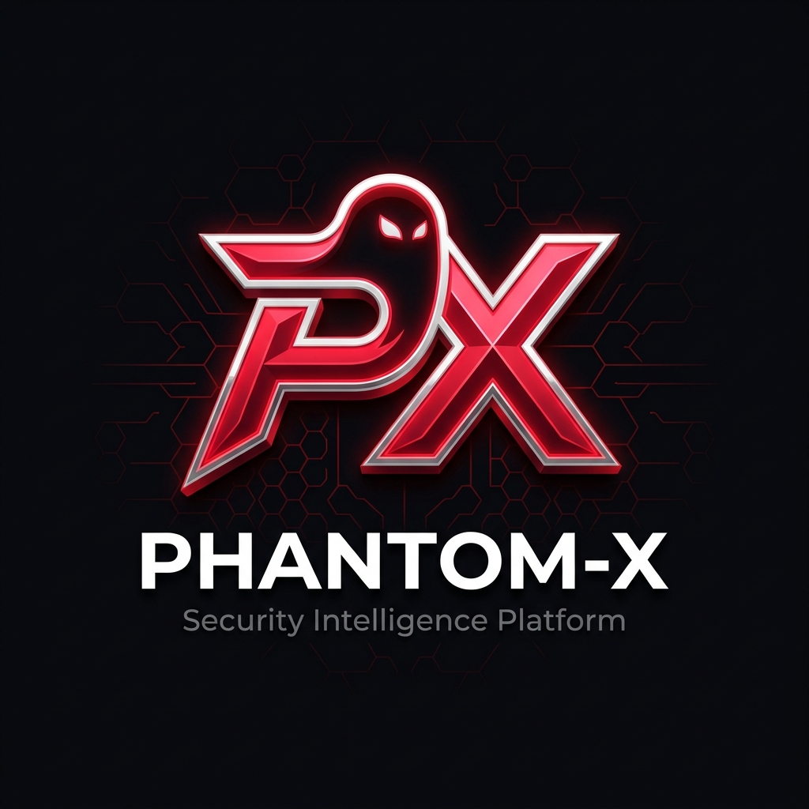

<div align="center">



# 🌌 PHANTOM-X
### **Premium Cyber Auditing & Penetration Testing Command Center**

PHANTOM-X is a state-of-the-art security platform designed for researchers, penetration testers, and security analysts. It bundles **66 industry-standard auditing tools** across **11 categories** into a unified workspace, served via a beautiful glassmorphic Web Console and an interactive dynamic Command Line Interface (CLI).

---

[](LICENSE)&nbsp;
[](https://www.python.org/)&nbsp;
[](https://www.docker.com/)&nbsp;
[](https://www.kali.org/)

</div>

---

## ⚡ Core Features

*   **Premium Glassmorphic UI**: A modern cyberpunk-themed dashboard with real-time process monitoring, live terminals (via xterm.js), and dynamic badges.
*   **Dynamic CLI Command Center**: Interactive text terminal with search query support (`/`), tag filters (`t`), and instant recommendation system (`r`).
*   **66 Audited & Verified Tools**: 100% of the tools in the catalog are tested, patched, and confirmed working (0 dead tools).
*   **Safe Docker Containerization**: Runs in a sandboxed Kali Linux Docker environment to keep your host machine clean and safe.
*   **Isolated Multi-Session Engine**: Separate terminal sessions, PTY wrappers, and command executors per browser tab or client.

---

## 📂 Catalog (11 Categories & 66 Tools)

| Reconnaissance & Info Gathering | 🌐 Network Scanning | 🕸️ Web Application Testing | 🔍 Vulnerability Assessment |
|---|---|---|---|
| • theHarvester<br>• Amass<br>• Subfinder<br>• Assetfinder<br>• Recon-ng<br>• SpiderFoot | • Nmap<br>• Masscan<br>• RustScan<br>• Naabu | • Nuclei<br>• Katana<br>• httpx<br>• ffuf<br>• dirsearch<br>• XSStrike<br>• sqlmap | • Nuclei Templates<br>• Trivy<br>• OpenVAS Community Docs<br>• Nikto |

| 🛡️ Password Auditing | ☁️ Cloud Security | 🐳 Container & K8s Security | 🔵 SOC Analyst Essentials |
|---|---|---|---|
| • Hashcat<br>• John The Ripper Jumbo<br>• CeWL | • ScoutSuite<br>• Prowler<br>• CloudSplaining | • kube-bench<br>• kube-hunter<br>• Trivy (Container) | • Wazuh<br>• Security Onion<br>• ELK Stack<br>• Graylog<br>• Zeek<br>• Suricata<br>• Snort3<br>• Volatility 3<br>• Autopsy<br>• Chainsaw<br>• Hayabusa<br>• MISP<br>• OpenCTI<br>• YARA |

| 🔴 Red Team & Emulation | 🐧 Linux Admin & Security | 🎯 Top 15 Must Learn Tools |
|---|---|---|
| • MITRE Caldera<br>• Atomic Red Team<br>• Prelude Operator | • Lynis<br>• OpenSCAP<br>• Falco<br>• Auditd Userspace | • Nmap, Wireshark, Burp Suite, Nuclei, Amass, Subfinder, ffuf, sqlmap, Wazuh, Suricata, Zeek, Volatility3, Autopsy, Lynis, Falco |

---

## 🚀 Installation & Quick Start

> [!NOTE]
> Docker configuration is highly recommended as it provides a clean pre-configured environment for all tools without cluttering your host system.

### **Method 1: Docker (Recommended)**

#### **1. Clone the repository**
```bash
git clone https://github.com/omkarmahadik96/PHANTOM-X.git
cd PHANTOM-X
```

#### **2. Start the Command Center**
```bash
docker compose up -d
```

#### **3. Access the Web Dashboard**
Open your browser and navigate to:
👉 **`http://localhost:5000`**

#### **4. Launch the Interactive CLI Menu**
To run the terminal CLI menu inside the running container:
```bash
docker exec -it hackingtool python3 hackingtool.py
```

---

### **Method 2: Local Setup (Without Docker)**

If you prefer running directly on your host Linux system (e.g. Kali Linux):

#### **1. Install Host Dependencies**
```bash
sudo apt-get update
sudo apt-get install -y git python3-pip curl wget nmap hydra sqlmap unzip zip tar net-tools golang ruby default-jdk
```

#### **2. Install Python Packages**
```bash
pip3 install --break-system-packages -r requirements.txt
```

#### **3. Run the Servers**
*   **To run the Web Console**: `python3 gui_server.py` (visit `http://localhost:5000`)
*   **To run the CLI Menu**: `python3 hackingtool.py`

---

## 🛠️ Developer & Customizations

*   **Dynamic Data Loader**: All tool paths, install parameters, and execution strings are configured in `tools_data.json`.
*   **Adding New Tools**: Simply insert a new JSON block inside the desired category in `tools_data.json` and sync the file!

---

> ⚠️ **Disclaimer:** This tool repository is created for authorized security auditing, penetration testing, and educational research purposes only. Please perform tests only on systems you own or have explicit written permission to test.
